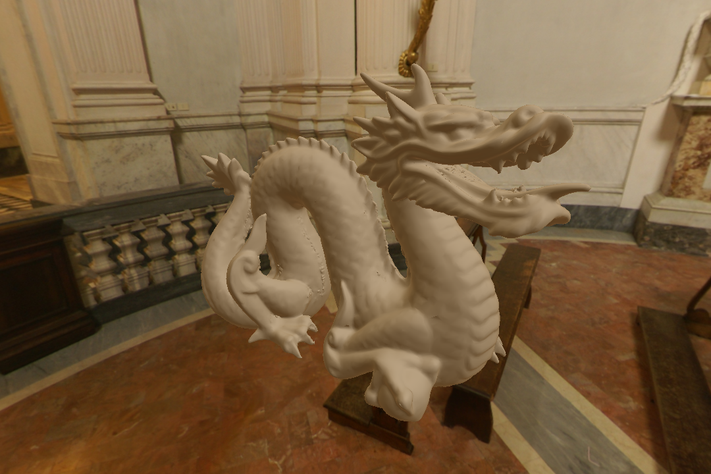

[](https://trello.com/b/ZRvpbbYC/acid)
[](https://eqmg.github.io/Acid/namespaces.html)
[](https://github.com/EQMG/Acid/actions?query=workflow%3ACI)

Acid is an open-source, cross-platform game engine written in modern C++17 and structured to be fast, simple, and extremely modular.

Vulkan is the sole graphics API, Vulkan can be accessed in apps with the provided Acid rendering pipeline. Metal is supported through [MoltenVK](https://github.com/KhronosGroup/MoltenVK); eventually, DirectX will be supported in a similar way.

This project is being worked on part-time by a single developer, this is under heavy development, expect bugs, API changes, and plenty of missing features.

## Features
 * Multiplatform (Windows, Linux, MacOS, 32bit and 64bit)
 * Multithreaded command buffers and thread safety
 * On the fly GLSL to SPIR-V compilation and reflection
 * Deferred physically based rendering (PBR)
 * Networking (HTTP, FTP, UDP, TCP)
 * Object serialization (JSON, XML)
 * Resource management using serialization
 * Event delegate callbacks with scoped functions
 * Bullet physics
 * Entity component system
 * Particle effect systems
 * File multi-path searching, and packaging
 * UI constraints system, and MSDF font rendering
 * Audio systems (flac, mp3, ogg, opus, wave)
 * Shadow mapping
 * Post effects pipeline (lensflare, glow, blur, SSAO, ...)
 * Model file loading (obj, glTF 2.0)
 * Animations loading (Collada)
 * Image file loading (png, jpeg, dng, tiff, OpenEXR, bmp, dds, ppm, tga)

## Dependencies
 * [Vulkan](https://www.khronos.org/vulkan) - Vulkan interface
 * [OpenAL](http://kcat.strangesoft.net/openal.html) - Audio interface
 * [Volk](https://github.com/zeux/volk) - Meta loader for Vulkan API
 * [GLFW](https://github.com/glfw/glfw) - Window creation
 * [Glslang](https://github.com/KhronosGroup/glslang) - Shader compiling
 * [Bullet3](https://github.com/bulletphysics/bullet3) - Physics integration
 * [PhysFS](https://icculus.org/physfs) - Archive file access
 * [third_party](Sources/third_party/README.md) - Small third party dependencies

# Code Snippets
```cpp
// Imports a 2D texture using nearest filtering.
auto guiBlack = Image2d::Create("Guis/Black.png", VK_FILTER_NEAREST);

// Imports a 3D cubemap (face names defined in Cubemap.cpp).
auto skyboxSnowy = ImageCube::Create("Objects/SkyboxSnowy", ".png");

// Imports a OBJ model.
auto dragon = ObjModel::Create("Objects/Testing/ModelDragon.obj");

// Creates a sphere model with 20 latitude and longitude bands with a radius of 1.
auto sphere = SphereModel::Create(20, 20, 1.0f);

// Plays a 3D sound (sound buffer resource internally managed), at half volume.
Sound jump("Sounds/Jump.ogg", Audio::Type::Effect, false, true, 0.5f);

// Loads a entity from a prefab file.
auto playerObject = GetStructure()->CreateEntity("Objects/Player/Player.json");
playerObject->AddComponent<Transform>();

// Creates a entity in code.
auto sphere = GetStructure()->CreateEntity();
sphere->AddComponent<Transform>(Vector3f(6.7f, 6.7f, -8.0f), Vector3f(0.0f, Maths::Radians(180.0f), 0.0f), Vector3f(3.0f));
sphere->AddComponent<Mesh>(SphereModel::Create(20, 20, 1.0f), // This will used the sphere buffers created earlier.
	std::make_unique<MaterialDefault>(Colour::White, Image2d::Create("Objects/Testing/Albedo.png"), 0.0f, 0.5f,
		Image2d::Create("Objects/Testing/Material.png"), Image2d::Create("Objects/Testing/Normal.png")));
sphere->AddComponent<Rigidbody>(std::make_unique<ColliderSphere>(), 2.0f); // Will be created weighing 2 units.

// Vector maths.
Vector2f a(3.0f, -7.2f);
Vector2f b(-1.74f, 15.4f);
Vector2f c = a * b;
// Distance between the two points.
float distance = a.Distance(b);
// Right shift of the x and y bits by 1.
Vector2i rightShift = Vector2i(5, 9) >> 1;

// Split a string by spaces.
std::string stringSource = "Hello world!";
std::vector<std::string> stringSplit = String::Split(stringSource, ' ');

// Will run a lambda on window resize, and when this object is deleted the lamdba is removed.
Window::Get()->OnSize() += [](Vector2ui size) {
	Log::Out("Hello world: ", size, '\n');
};

// A value container that calls a delegate on value assignments.
DelegateValue<Vector3f> da;
da += [](Vector3f value) {
	Log::Out("New value: ", value, '\n');
};
da = {10.0f, -4.11f, 99.991f};

// Time addition.
Time dateTime = 4h + 2min + 11s + 9ms + 1us + 4ns;

// Calls the function once after 150 milliseconds.
Timers::Get()->Once(150ms, []() {
	Log::Out("Timer Once After\n");
});
// Calls the function every 4 seconds. 
Timers::Get()->Every(4s, []() {
	Log::Out("Timer Every Tick\n");
});
// Calls the funcion every 7 seconds 3 times.
Timers::Get()->Repeat(7s, 3, []() {
	static uint32_t i = 0;
	Log::Out("Timer Repeat Tick #", i, '\n');
	i++;
});
```

## Screenshots





## Compiling
All platforms depend on [CMake](https://cmake.org/download), 3.11.0 or higher, to generate IDE/make files.

CMake options (default ON):
* `BUILD_TESTS`
* `ACID_INSTALL_EXAMPLES`
* `ACID_INSTALL_RESOURCES`  

If you installed Acid using only system libs, then `find_package(Acid)` will work from CMake. Versioning is also supported.  
When using `find_package(Acid)` the imported target `Acid::Acid` will be created.  
The `ACID_RESOURCES_DIR` variable will also be available, which will point to the on-disk location of `Acid/Resources` (if installed).

[Python 3](https://www.python.org/downloads/), [Vulkan SDK](https://www.lunarg.com/vulkan-sdk/), [OpenAL](https://www.openal.org/downloads/), and [OpenAL SDK](https://openal-soft.org/#download) are required to develop Acid.

Make sure you have environment variables `VULKAN_SDK` and `OPENALDIR` set to the paths you have Vulkan and OpenAL installed into.

Ensure you are using a compiler with full C++17 support, on Windows it is recommended that you use MSVC or [MinGW w64](https://sourceforge.net/projects/mingw-w64/?source=navbar).

If using Visual Studio it must be 2015 or later. Use the Visual Studio installer and select both "Desktop development with C++" and "Windows SDK" if they are not already installed. Then on Visual Studio Acid can be opened as a CMake workspace folder.

On Linux Acid requires `xorg-dev`, `libopenal1`, and `libvulkan1` to be installed. Read about how to setup [Vulkan on Linux](https://vulkan.lunarg.com/doc/sdk/latest/linux/getting_started.html) so a Vulkan SDK is found.

Setup on MacOS is similar to the setup on Linux, a compiler that supports C++17 is required, such as XCode 10.0.

## Contributing
You can contribute to Acid in any way you want, we are always looking for help. You can learn about Acids code style from the [GUIDELINES.md](.github/GUIDELINES.md).
